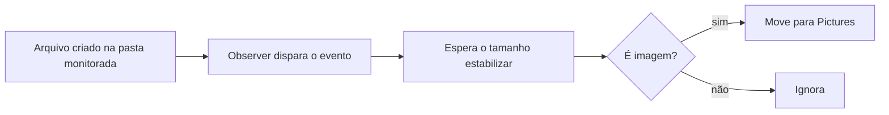

<h1 align="center">🖼️ Image Sentinel</h1>

<p align="center">
  Automação em Python que organiza imagens baixadas, sem ação manual.
</p>

<p align="center">
  
  
  
</p>

---

## 📌 Resumo

O Image Sentinel monitora a pasta de Downloads e identifica arquivos de imagem assim que eles chegam. Quando o download termina — ou seja, quando o tamanho do arquivo para de mudar — o script move a imagem para a pasta de Pictures.

O projeto foi desenvolvido como estudo prático de automação de tarefas no sistema operacional, monitoramento de arquivos e organização de fluxo de trabalho do dia a dia.

## ⚙️ O que ele faz

- Observa uma pasta específica em tempo real
- Detecta a criação de arquivos
- Filtra extensões de imagem (`.jpg`, `.jpeg`, `.png`, `.gif`, `.bmp`, `.tiff`)
- Aguarda o download terminar antes de mover o arquivo
- Move o arquivo para a pasta de destino definida

## 🔄 Fluxo



## 🧰 Tecnologias

| Recurso | Uso |
|---|---|
| **Python** | Linguagem do projeto |
| **watchdog** | Monitoramento de eventos do sistema de arquivos |
| **shutil** | Movimentação de arquivos |
| **os** | Operações do sistema operacional |
| **time** | Espera e sincronização |

## 📁 Arquivos

| Arquivo | Função |
|---|---|
| `ImgSentinel.py` | Inicia o monitoramento e mantém o observer ativo |
| `ImgHandler.py` | Lógica de detecção e movimentação dos arquivos |
| `ImgSentinel.bat` | Execução rápida no Windows |

## ▶️ Como executar

Instale a dependência:

```bash
pip install watchdog
```

Ajuste os caminhos em `ImgHandler.py`:

```python
caminho = r"C:\Users\<usuario>\Downloads"   # pasta monitorada
destino = r"C:\Users\<usuario>\Pictures"    # pasta de destino
```

Execute:

```bash
python ImgSentinel.py
```

No Windows, também é possível rodar o `ImgSentinel.bat`.

## 🚀 Possíveis extensões

O mesmo conceito pode ser ampliado para:

- Mover arquivos por tipo (PDF, ZIP, documentos)
- Separar arquivos por extensão
- Organizar downloads por data ou categoria
- Criar pastas automáticas a partir de regras definidas

---

<details>
<summary>🇬🇧 <b>English version</b></summary>

<br>

**Image Sentinel** is a Python automation project that organizes downloaded images without manual work.

### Overview

The system watches the Downloads folder and detects newly created image files. Once the file is fully downloaded — that is, once its size stops changing — the script moves it to the Pictures folder.

This project was created as a practical study of file-system automation, monitoring, and productivity-oriented scripting.

### What it does

- Watches a target folder in real time
- Detects created files
- Filters image extensions (`.jpg`, `.jpeg`, `.png`, `.gif`, `.bmp`, `.tiff`)
- Waits for the download to finish before moving the file
- Moves the file to a configured destination folder

### Tech stack

`Python` · `watchdog` · `shutil` · `os` · `time`

### Files

| File | Purpose |
|---|---|
| `ImgSentinel.py` | Starts monitoring and keeps the observer alive |
| `ImgHandler.py` | Detection and file-moving logic |
| `ImgSentinel.bat` | Quick run on Windows |

### How to run

```bash
pip install watchdog
```

Update the paths in `ImgHandler.py` (`caminho` = monitored folder, `destino` = destination folder), then:

```bash
python ImgSentinel.py
```

On Windows, you can also use `ImgSentinel.bat`.

</details>
